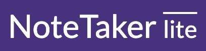
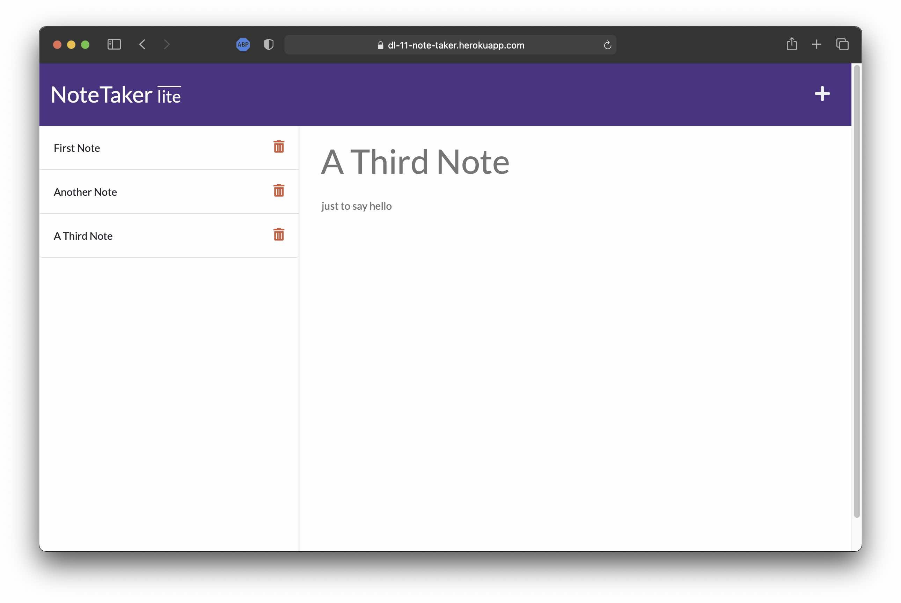

  Launch App: <a href="https://druludwig.github.io/11-note-taker/" target="_blank">https://druludwig.github.io/11-note-taker/</a>  
  
  

  ## Description
  A simple note organizer that remembers your data from day to day.
 
  ## Installation
  This is a web-based app and does not require installation.

  ## Instructions
  Click the link above or click here:
  - Enter a title, compose your note, and click Save 💾
  - Click a note title to load the complete text

  ## License
  Use of this project is subject to the terms and conditions of the <a href="https://www.mit.edu/~amini/LICENSE.md">MIT License</a>.
  ## Questions 
  - Please email any questions to: <a href="mailto:dru.ludwig-github@yahoo.com">dru.ludwig-github@yahoo.com</a>
  - Find me on GitHub: <a href="https://github.com/druludwig">druludwig</a>
  
## Screenshot
